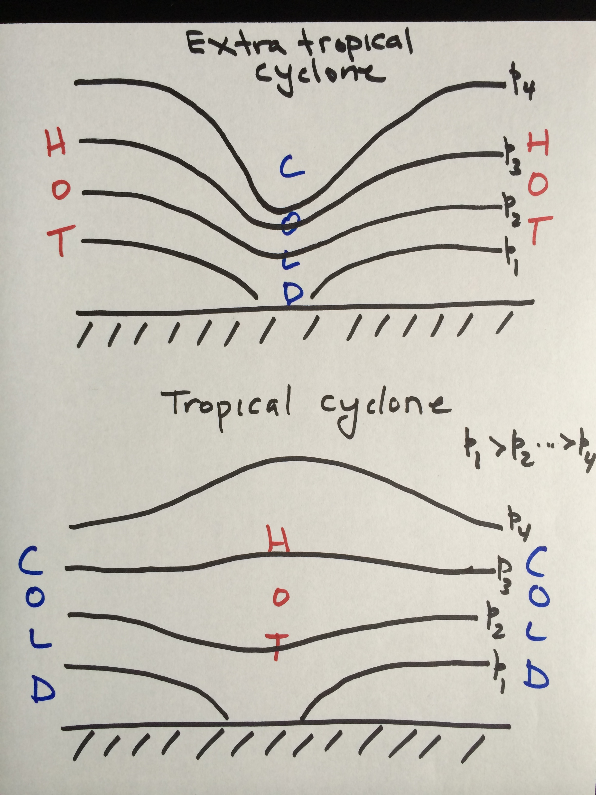

Climate Change: Day 11
=====================
date: September 30, 2014

### Last Time: tropical cyclone as a heat engine

See Dropbox > Talks > HurricaneTalk2013 > figures

$$
\hbox{MPI} \sim \frac{\hbox{SST}}{T_o}\hbox{BL}_{f}(\hbox{SST})
$$

MPI (maximum potential intensity) is the highest wind speed (rotational) in units of meters per second.

SST is the ocean temperature at the surface, $T_o$ is the temperature at the top of the hurricane and BL$_{f}$(SST) is the heat flux near the ocean surface. The heat flux depends on SST.

Extreme value theory (EVT) is a statistical theory that estimates the risk of extreme, rare events.

Suppose we record the highest wind speed (m s$^{-1}$) from 10 consecutive hurricanes.

* 34.5, 44.2, 57.5, 33.8, 67.8, 38.2, 41.5, 71.2, 61.0, 49.1

We order the values from lowest to highest.

* 33.8, 34.5, 38.2, 41.5, 44.2, 49.1, 57.5, 61.0, *67.8*, *71.2*

This tells us that 20% of the hurricanes have winds that exceed 61 m s$^{-1}$ and 10% have winds that exceed 67.8 m s$^{-1}$. EVT uses these quantile wind speeds to work out a theoretical highest possible wind speed, which we will call the **limiting intensity (LI)**.

