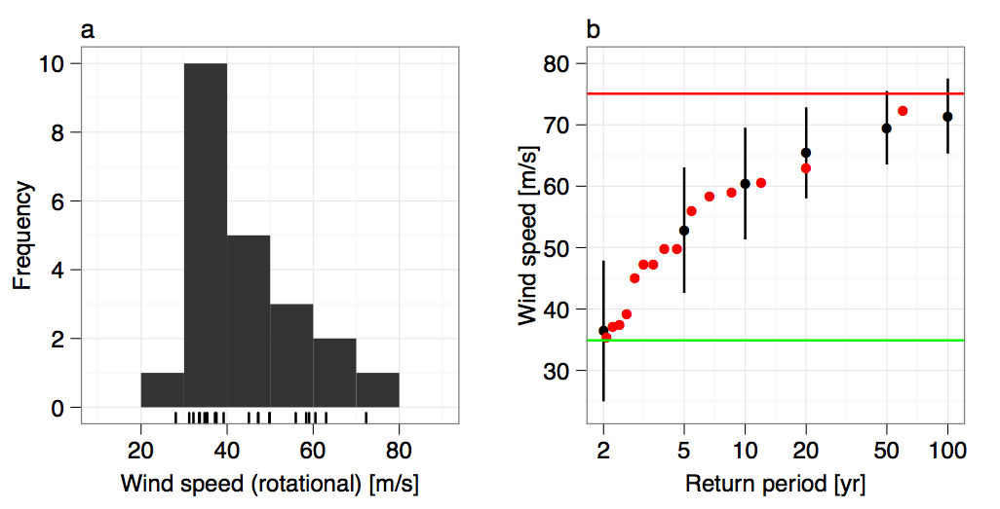
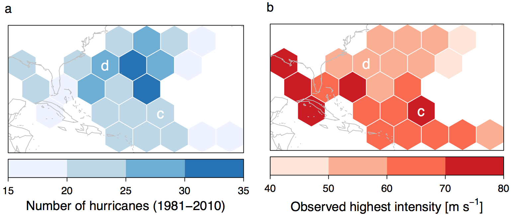

Climate Change: Day 11
=====================
date: September 30, 2014

Hurricanes are heat engines: They accumulate heat at high temperature and exhaust heat at low temperatures. The difference between the amount taken in and the amount exhausted is the work done to produce the fast winds.

### How does this help us understand future hurricane activity?


Term Project Datasets
=====================

Datasets for term project. I'll continue to post links. You choose one. Datasets I've posted already:

[U.S. Precipitable Water](http://myweb.fsu.edu/jelsner/PW_US.txt)

[Florida Monthly Temperature](http://myweb.fsu.edu/jelsner/data/FLMonthlyT.txt)

[Florida Monthly Precipitation](http://myweb.fsu.edu/jelsner/data/FLMonthlyP.txt)

[Tallahassee Daily High and Low Temperature](http://myweb.fsu.edu/jelsner/data/TLHT.txt)

[U.S. Hurricane Frequency](http://myweb.fsu.edu/jelsner/data/US.txt)

Transverse Motion of a Hurricane
======================


Maximum Potential Intensity (MPI)
=================================


SST is the ocean temperature at the surface, To is the temperature at the top of the hurricane and BLf(SST) is the heat flux near the ocean surface. The heat flux depends on SST.

Limiting Intensity (LI)
=======================

Extreme value theory (EVT) estimates the chance of rare events using statistics. Suppose we record the highest wind speed (m/s) from ten consecutive hurricanes.

* 34.5, 44.2, 57.5, 33.8, 67.8, 38.2, 41.5, 71.2, 61.0, 49.1

We order the values from lowest to highest.

* 33.8, 34.5, 38.2, 41.5, 44.2, 49.1, 57.5, 61.0, **67.8**, **71.2**

Thus 20% of the hurricanes have winds exceeding 61 m/s and 10% have winds exceeding 67.8 m/s. EVT uses these quantile wind speeds to work out a highest possible wind speed. We call this the **limiting intensity (LI)**.

Limiting Intensity (LI)
=======================



======


======


======


======


======




======


======


======


U.S. Hurricanes
===============


```r
L = "http://myweb.fsu.edu/jelsner/data/US.txt"
H = read.table(L, header = TRUE)
H[1:2, ]
```

```
  Year All MUS G FL E
1 1851   1   1 0  1 0
2 1852   3   1 1  2 0
```

The distribution of Florida hurricanes by year is obtained by

```r
table(H$FL)
```

```

 0  1  2  3  4 
88 42 24  5  1 
```

There are 88 years without a FL hurricane, 42 years with exactly one, and so on.


Monsoons
========

[SW U.S. Monsoon 2014](https://vimeo.com/106827999)
