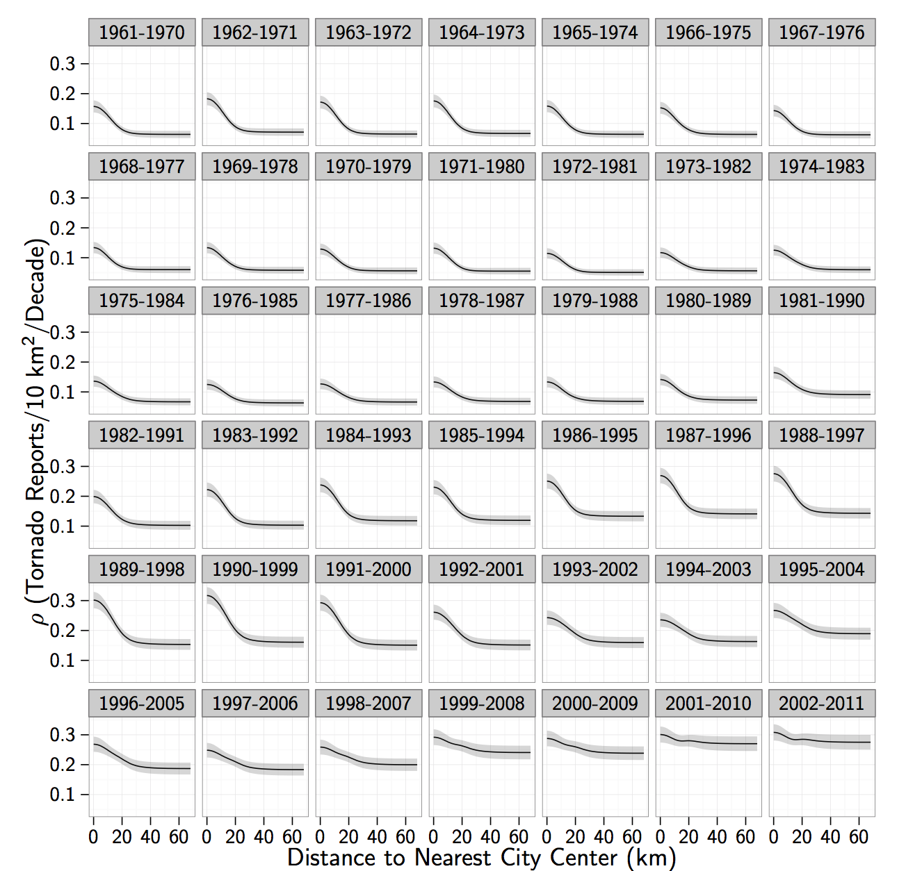
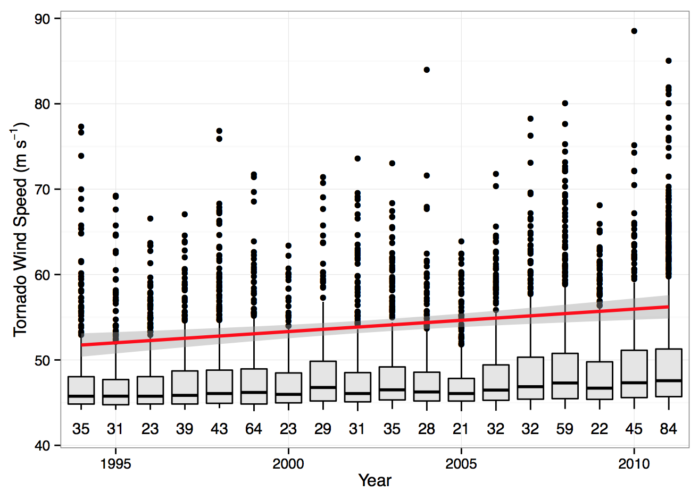
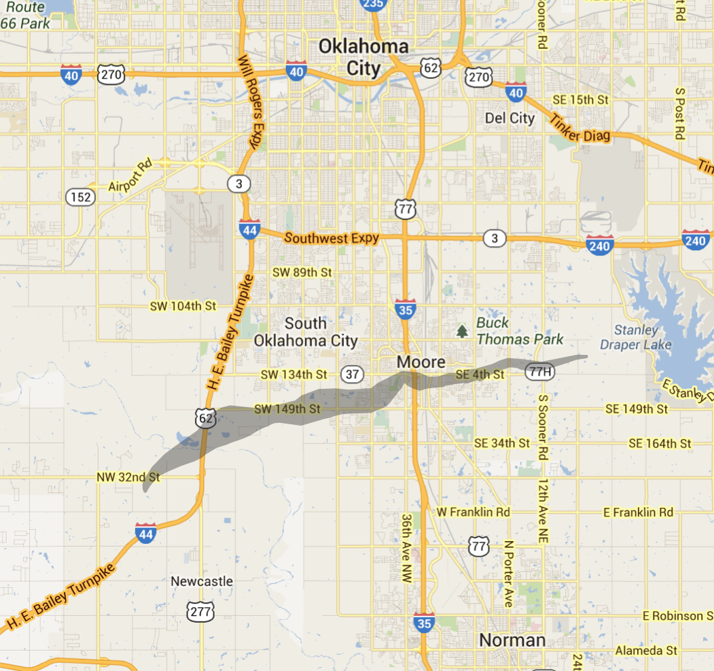
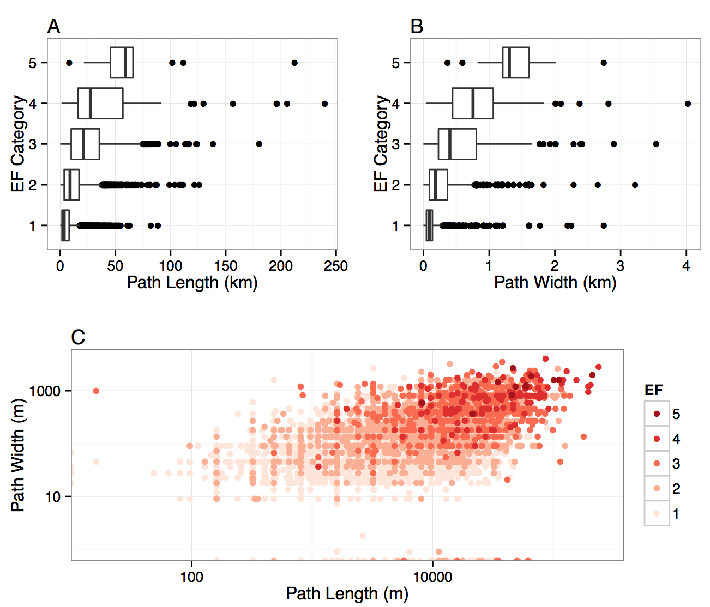
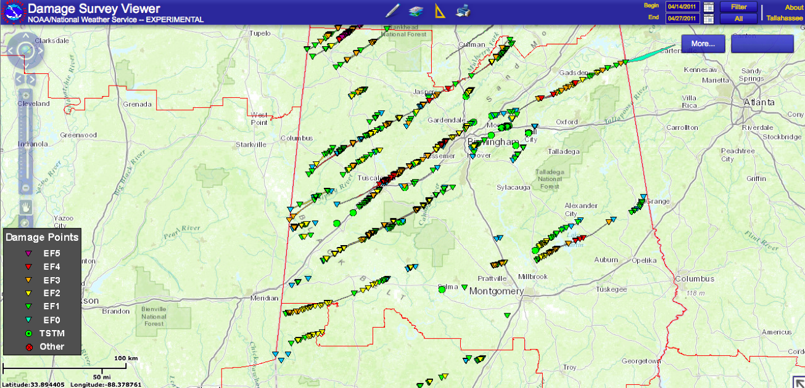
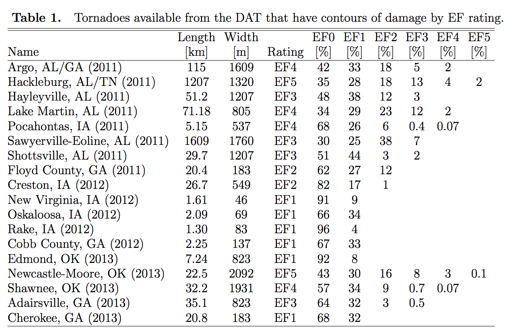

Climate Change: Day 21
=====================
date: November 13, 2014

* Exam 3: Thursday, December 4th (final class period). 

* Exam 4 (optional): Friday, December 12th, 3-5p.

* Term project due date: Tuesday, December 9th. Email your HTML file to jelsner@fsu.edu.

* Last time: Improved tornado reports; today: Are tornadoes getting stronger? First volume-rendered tornado simulation.

=====

======

=====

=====

Tornado intensity
=================
[Moore video from the ground](https://www.youtube.com/watch?v=idAaalglvl8)

[Moore video from the ground](https://www.youtube.com/watch?v=cJTorIDx6TE)

[Moore tornado from dual polarization doppler radar](https://www.youtube.com/watch?v=_O_qg-1SrUE)

Damage surveys are still the most reliable way to estimate tornado intensity

=====

=====

=====

=====
[EF damage scale](http://www.spc.noaa.gov/efscale/ef-scale.html)

## Problem

* An estimate of how strong a tornado can get requires a continuous scale of intensity.
* The EF damage scale is categorical.
* We can count the number of tornadoes by EF category.
* But a time-series plot of the number of tornadoes by EF category does not answer the question: Are tornadoes getting stronger?

### If we solve this problem

=====

=====

=====

====

====

====

====

====

====

====

====
[Tornado simulation](http://orf5.com/sls14/)

====
T or F: According to recent research by Professor Elsner and his students, the density of tornado reports today near cities is about the same as the density of reports in rural areas.

