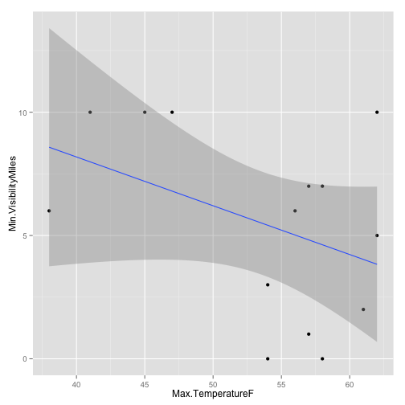
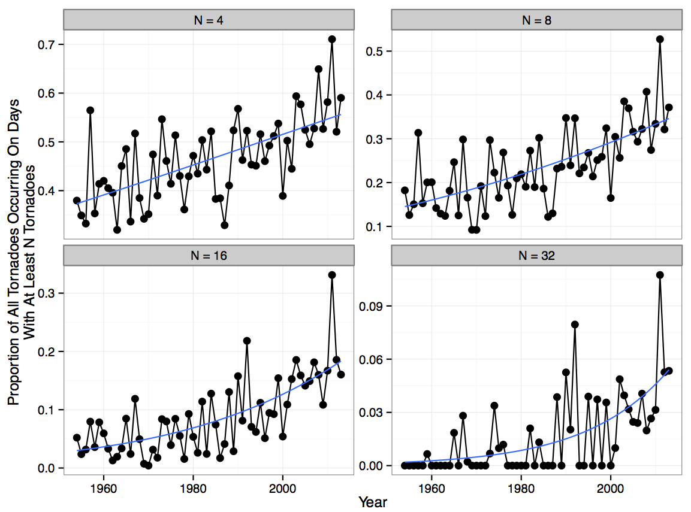
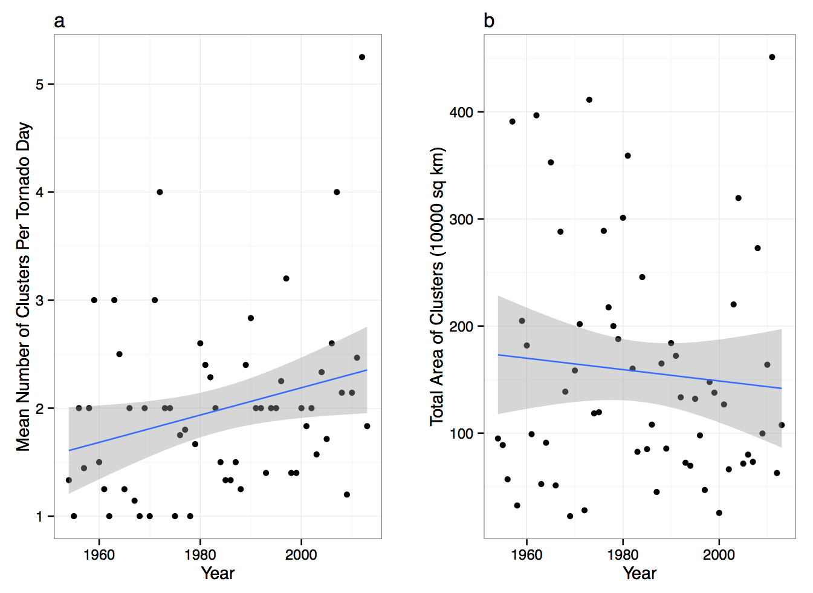

Climate Change: Day 22
=====================
date: November 18, 2014

* Exam 3: Thursday, December 4th (final class period). 

* No class next Tuesday: Southeast Division of the Association of American Geographers, University of Georgia

* Term project due date: Tuesday, December 9th. Email your HTML file to jelsner@fsu.edu.

* Today: Are tornadoes occurring more often?

* T or F: According to recent research by Professor Elsner and his students, today the density of tornado reports near cities is about the same as the density of reports in rural areas.

How to get weather station data
=============
* [Weather Underground](http://www.wunderground.com/history/)

* Set Location: E.g., Portland Oregon, then Submit

* Select Custom tab then Get History

* Set the From/To dates Then Get History

* Scroll to bottom and select Comma Delimited File

* Copy the link

======

```r
L = "http://www.wunderground.com/history/airport/KPDX/2014/11/1/CustomHistory.html?dayend=14&monthend=11&yearend=2014&req_city=NA&req_state=NA&req_statename=NA&format=1"
df = read.csv(L, stringsAsFactors = FALSE)
df$Date = as.Date(df$PST)
library(ggplot2)
ggplot(df, aes(x = Date, y = Min.Humidity)) + 
  geom_line()
```

 

====

```r
ggplot(df, aes(x = Max.TemperatureF, y = Min.VisibilityMiles)) +
  geom_point() + 
  geom_smooth(method = lm)
```



[Online R course](http://blog.rstudio.org/2014/11/06/introduction-to-data-science-with-r-video-workshop/)

Last time: Are tornadoes getting stronger?
=====
[Tornado simulation](http://orf5.com/sls14/)

## Problem

* An estimate of how strong a tornado can get requires a continuous scale of intensity.
* The EF damage scale is categorical.
* A count of the number of tornadoes by EF category does not answer the question: Are tornadoes getting stronger?

====


====


====


====


====


====


====


====


====

```r
L = "http://myweb.fsu.edu/jelsner/TorBySTYR.txt"
df = read.table(L, header = TRUE)
head(df)
```

```
  Year ST nT avgDoY medDoY
1 1954 AL  9  224.4    339
2 1954 AR 26  115.3    120
3 1954 CA  1  176.0    176
4 1954 CO  8  136.8    136
5 1954 CT  2  130.0    130
6 1954 DE  1  182.0    182
```

```r
library(ggplot2)
```

====

```r
ggplot(df, aes(x = Year, y = nT)) +
  geom_point() + geom_line() +
  facet_wrap(~ ST)
```


====


====


====


====


====


====


====


====
[Pilger NE Twin Tornadoes this past June](https://www.youtube.com/watch?v=V9d7DDQawVE)

