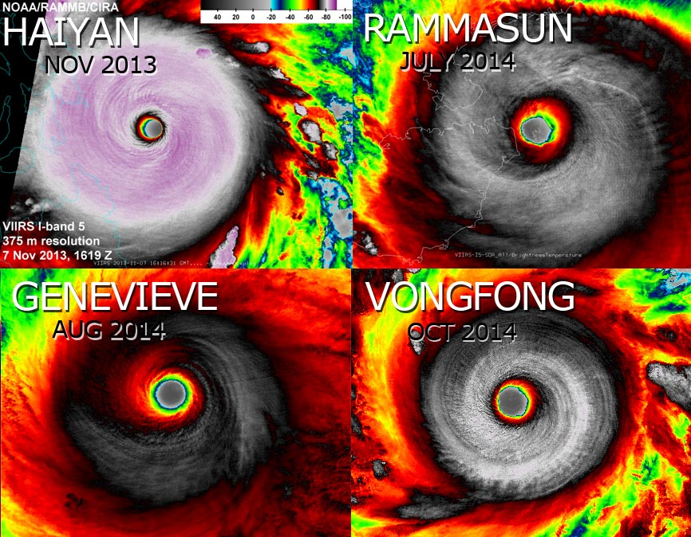

Climate Change: Day 14
=====================
date: October 9, 2014

Test #2: Next Thursday, October 16.

Last time: (1) Climate models. What can they say about future hurricanes? Not much. (2) Digging up the past. How can geology help us understand future hurricanes?

**"It is a capital mistake to theorize before one has data. Insensibly one begins to twist facts to suit theories, instead of theories to suit facts."---Sir Arthur Conan Doyle**

Today: ACE (one of my pet peeves): why I think it confounds rather than illuminates.


The sensitivity of limiting intensity to ocean temperature (SST) is about
=============
**a. 2 m/s/C**

**b. 4 m/s/C**

**c. 6 m/s/C**

**d. 8 m/s/C**

**e. 10 m/s/C**


Hot Towers
==========
According to our work here at FSU, the reason global climate models (GCMs) are not able to tell us about future hurricane activity is because they don't yet have the correct sensitivity to ocean temperature. In short, modeled TCs don't operate as heat engines.

This is likely due to the limited spatial resolution and also to the missing physics. The physics of hot towers in particular. What is a hot tower?

[Hot towers](https://www.youtube.com/watch?v=rU0Y7qjoacA)

Mesoscale vortices
==================


Not All Category 5's Are the Same
=================================


Accumulated Cyclone Energy
==========================


[ACE Wikipedia](http://en.wikipedia.org/wiki/Accumulated_cyclone_energy)

========


============


============


============


============


============


=============

```r
setwd("~/Dropbox/Hurricanes")
library(dplyr)
library(ggplot2)
load("best.use.2013.RData")
best.use$Int = best.use$Wmax * .5144
```


```r
library(raster)
r = raster(ncol = 20, nrow = 10, 
           xmn = -100, xmx = -20, 
           ymn = 10, ymx = 50)
```


```r
Tracks.sdf = best.use
coordinates(Tracks.sdf) = c("lon", "lat")
ll = "+proj=longlat +ellps=WGS84"
proj4string(Tracks.sdf) = CRS(ll)
```

================

```r
library(rasterVis)
Tracks.sdf %>%
  subset(Yr >= 1967 & Wmax >= 64) %>%
  rasterize(r, field = 'Int',
            fun = max) %>%
  levelplot(sub = "Peak Intensity [m/s]")
```


Eglin Air Force Base
====================


======


Attibuting Extreme Events to Climate Change
===========================================

http://www2.ametsoc.org/ams/assets/File/publications/BAMS_EEE_2013_Full_Report.pdf
