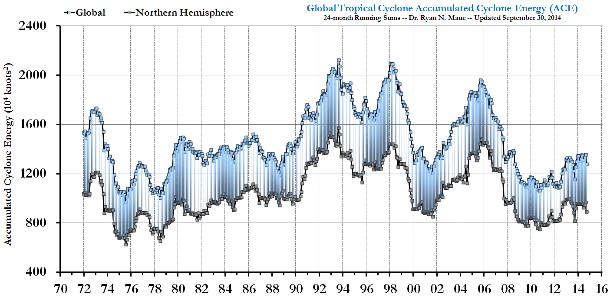
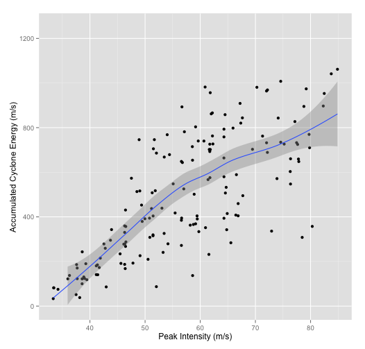

Climate Change: Day 15
=====================
date: October 14, 2014

Test #2: Postponed until next Tuesday (Oct 21).

Last time: Hot towers, ACE: why I think it confounds rather than illuminates.

Today: Review

========

============

============

============

Review for Exam 2
=================

**Date**: Tuesday, October 21

**Topics**: jet stream, cyclones, Arctic amplification, temperature gradients, pressure vs height relationship, tropical cyclones, transverse circulation, cold vs warm core, conditional instability, maximum potential intensity (MPI), sea-surface temperature, heat engine theory, limiting intensity, sensitivity of limiting intensity, monsoon and monsoon season, hurricane intensity, major hurricane, stronger but fewer, Kerry Emanuel, Jennifer Francis, Jeff Donnelly, Kam-biu Liu, paleotempestology, ggplot2, dplyr, read.table, tropical cyclones in global climate models, hot towers, return period, overwash deposits.

[Sensitivity Lecture](http://prezi.com/otpkzwhjjr4q/how-sensitive-are-hurricanes-to-warming-seas)

Sample Questions
================

[Poll Everywhere](http://www.polleverywhere.com/)
