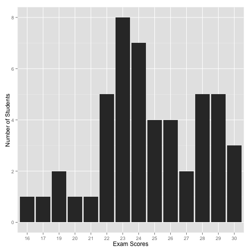

Climate Change: Day 8
=====================
date: September 23, 2014

Last Time

Exam 1, Distribution of grades, graphs


```r
Exam1 = read.table("http://myweb.fsu.edu/jelsner/Exam1.txt", 
                   header = TRUE)
library(ggplot2)
ggplot(Exam1, aes(factor(Score))) + 
  geom_histogram() +
  xlab("Exam Scores") +
  ylab("Number of Students")
```

 

Today
=====
Storms: Tropical vs extra-tropical: warm vs cold core
Jet stream what causes the jet stream?
Rossby theory

Animation of vorticity

[State Time Series](http://www.ncdc.noaa.gov/news/state-annual-and-seasonal-time-series)
