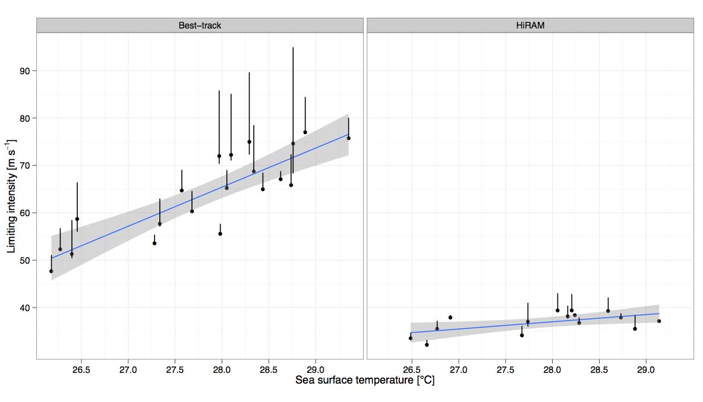
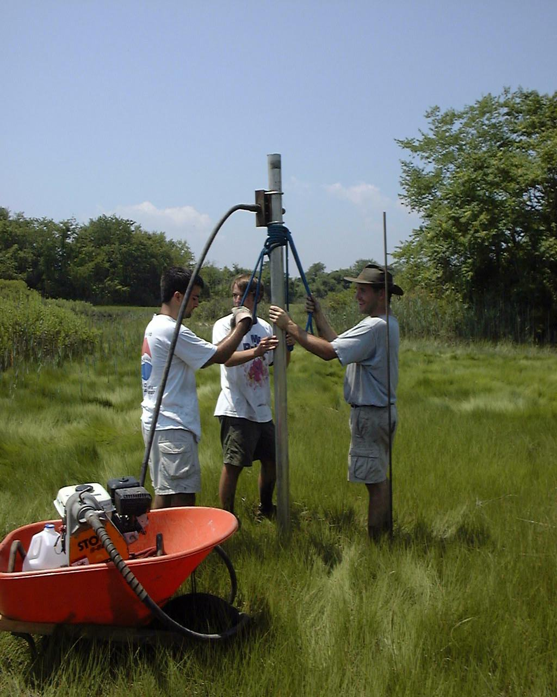
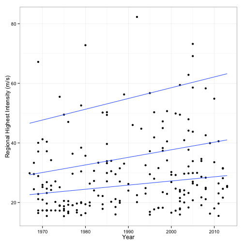

Climate Change: Day 13
=====================
date: October 7, 2014

Test #2: Next Thursday, October 16

Think Graduate School week
Undergraduate listserv: email Amber (avazquez@fsu.edu) to be added to the list.

Last time: Evidence for stronger hurricanes

Hurricane activity: Global, regional, frequency, clusters, size, rainfall, what about wind shear?

Today: (1) Climate models. What can they say about future hurricanes? (2) Digging up the past. What can geology tell us about future hurricanes?

Arctic amplification refers to:
===========================

a. jet stream becoming stronger

b. Coriolis force becoming weaker

c. greater warming near the poles than across middle latitudes

d. none of the above

e. all of the above

Write your answer and your full name on the post-it note.

More physics
==============


More details
==============


More complexity
====================


Tropical cyclones in climate models

[Community Earth System Model](https://www.youtube.com/watch?v=Cxsg7uvVSBE)

Sensitivity: Observed vs GCM
===============================


================


================


Paleotempestology
=================


=======



=======


Counting hurricane-induced sand layers in sediment cores taken near the coast, scientists can get an estimate of the frequency of extreme hurricanes in the past. But what are the intensities of these prehistorical hurricanes?

Modern analogues, statistical model, grainsize distribution.

===========
[Jeff Donnelly](https://www.youtube.com/watch?v=dvvuMnjBgA8)

[Coring Western Lake](https://www.youtube.com/watch?v=zQWU6OKRHMI)

Tropical Cyclones near Tallahassee
==================================

```r
library(dplyr)
L = "http://myweb.fsu.edu/jelsner/data/TLH_TC.txt"
df = read.table(L, header = TRUE)
df[1:4, c(5:9, 16:18)]
```

```
    Yr Mo Da hr  Wmax   dis    lon   lat
1 1851  8 20 21 65.27 983.5 -80.93 22.26
2 1851  8 20 22 63.36 965.2 -81.08 22.38
3 1851  8 20 23 61.54 947.6 -81.24 22.49
4 1851  8 21  0 60.00 930.5 -81.40 22.60
```

==============================

```r
library(ggplot2)
df %>%
  filter(WmaxS >= 34, SYear >= 1967) %>%
  group_by(SYear, Sid) %>%
  summarize(RMI = max(WmaxS)) %>%
ggplot(., aes(x = SYear, y = RMI * .447)) +
  geom_point() +
  geom_quantile(quantiles = c(.5, .75, .95)) +
  theme_bw() +
  xlab("Year") + ylab("Regional Highest Intensity (m/s)")
```



Label the axes
==============


==============


Maps with R
===========
[Small Multiple Choropleth Maps](http://youtu.be/IXNhaOOcG8A)

