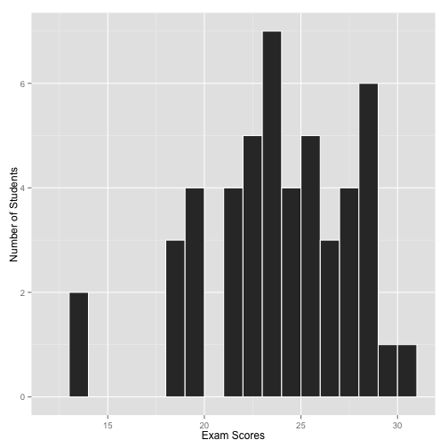

Climate Change: Day 18
=====================
date: October 23, 2014

Videos of dust devils, fire whirls, waterspouts, and tornadoes. Supercell tornadoes. Goldilocks of convection.

Exam 3 is now scheduled for December 4th. Last day of class. Exam 4 will be given during the final exam week as an optional test.

======

```r
Exam2 = read.table("http://myweb.fsu.edu/jelsner/Exam2.txt", header = TRUE)
library(ggplot2)
ggplot(Exam2, aes(Score)) + 
  geom_histogram(binwidth = 1, col = "white") +
  xlab("Exam Scores") +
  ylab("Number of Students")
```



======

```r
round(mean(Exam2$Score), 1)
```

```
[1] 23.4
```

```r
sd(Exam2$Score)
```

```
[1] 3.828
```

=======================

[Dust devil video](https://www.youtube.com/watch?v=AM1OxqBSV-8)

* most have winds between 15 and 30 m/s

* the vortex is not connected to a cloud

* smallest: 1/2 m wide and 2 m high, largest: 10 m wide and 1000 m high

* last for a few seconds to over 20 minutes

* they are most common from 1 - 2p, soil hottest at this time of day, also more common from May through July when the sun angle is highest.

Tallahassee vs Las Vegas
========================


[Dust devil video](https://www.youtube.com/watch?v=AwKc7H5gIWo)

======
[Fire whirl video](https://www.youtube.com/watch?v=5SyX2NUEkKk)

* most are less than 1 m wide and between 15 and 30 m tall

* they can last between a few seconds to more than an hour

* temperatures exceeding 1000 degrees C

* the vortex is not connected to a cloud

[Fire whirl in Australia video](https://www.youtube.com/watch?v=lsyvOYcWgcg)

========

[Waterspout](https://www.youtube.com/watch?v=iwVFrqW79-c)

* tornadoes over water

* wind speeds range between 25 and 85 m/s

* most common between 4 and 7p

[Waterspout Australia](https://www.youtube.com/watch?v=pr1gGkykgsw)

[Waterspout Oldsmar, FL](https://www.youtube.com/watch?v=BgyQzuGSGVc)

[Joe Golden](http://usatoday30.usatoday.com/weather/wspouts.htm)

Supercell tornadoes
===================

[Tim Samaras](https://www.youtube.com/watch?v=7KDz6dGQ5RE) 

[Deadly Nebraska tornado](https://www.youtube.com/watch?v=1ysA4wJ2PZw)

[Tim Samaras how tornadoes form](https://www.youtube.com/watch?v=8EaLJJtVHTA)

[Timmer and Cantore inside a tornado](https://www.youtube.com/watch?v=Z2OtHEt7Qk4)

