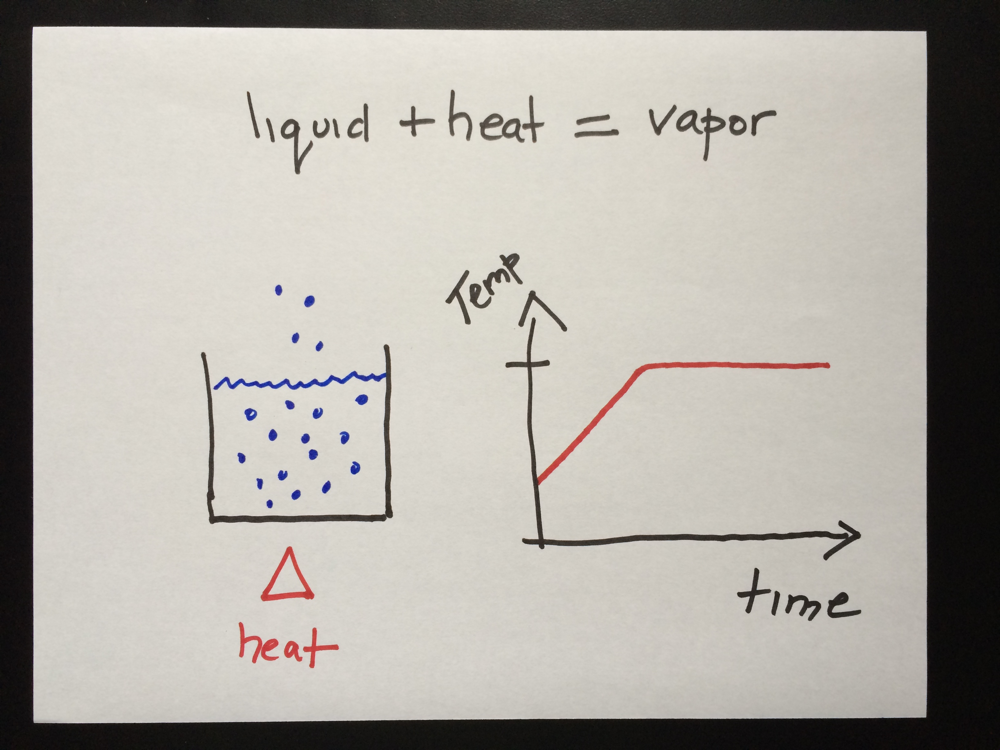

Climate Change: Day 5
=====================
date: September 9, 2014

[Tropical Cyclone Forecast Models](http://moe.met.fsu.edu/tcgengifs/)

Last Time
=========

+ Latent heat: energy that goes into evaporation without warming.
+ Saturation: dynamic equilibrium between evaporation & condensation. 
+ Saturation vapor pressure: vapor pressure at saturation. Defined with respect to a surface of liquid (or ice).
+ Convection: vertical movement of air. Rising air leads to expansion and cooling.

Latent Heat
===========

Convection
==========

Today
=====

+ Convective instability & parcel theory
+ Graphing temperature & precipitation

[Poll Everywhere](http://www.polleverywhere.com/)

Lapse Rates & Stability
=======================

Parcel Theory
=============

Heat Transfer
=============

Tracking Hurricanes
===================

=========

=========

