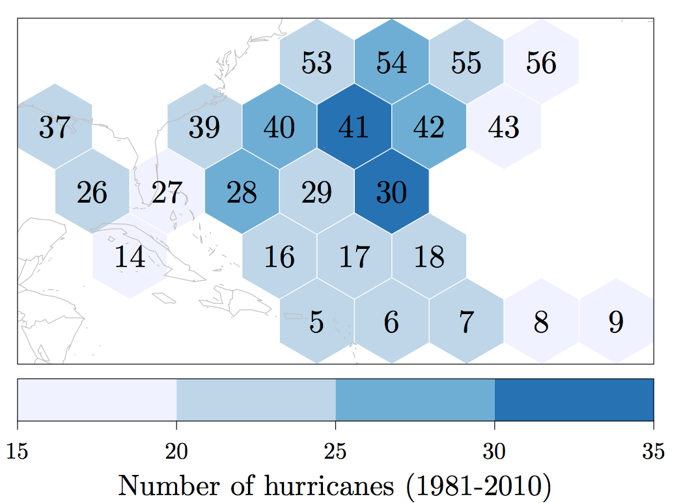
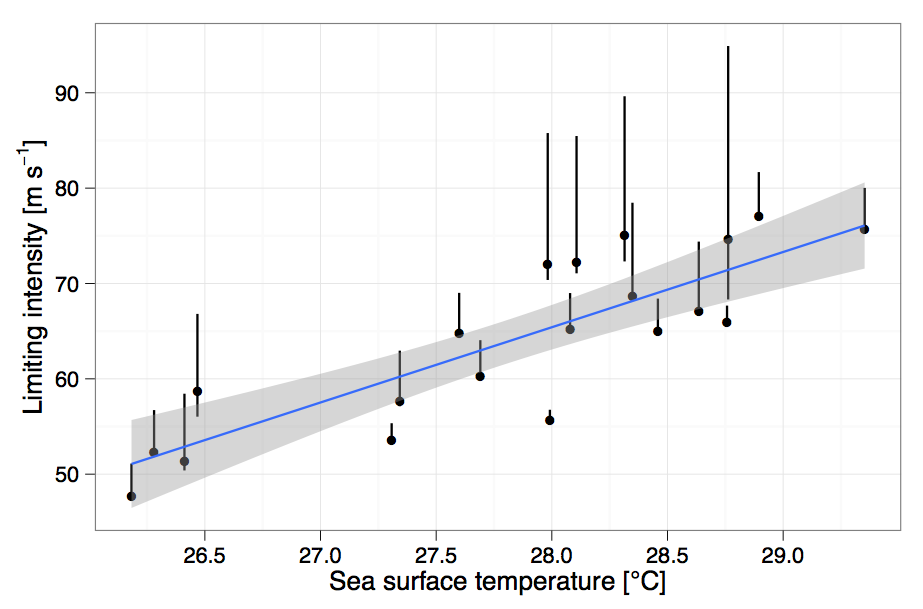

Sensitivity of hurricanes to ocean heat
======================================

Last week you learned the difference between potential intensity and limiting intensity. 

In short, **potential intensity** is the theoretical limit to how strong a hurricane can get given how warm the ocean under it is. 

**Limiting intensity** is the statistical limit to how strong a hurricane can get.

=====

In this lesson you will learn:

* How we can use limiting intensity to work out just how sensitive hurricanes are to rising ocean temperatures.

This is important because oceans are getting hotter.

Maximum Potential Intensity (MPI)
=================================

As we discussed last time

$$
\hbox{MPI} \sim \frac{\hbox{SST}}{T_o}\hbox{BL}_f(\hbox{SST})
$$

* SST is the temperature of the top of the ocean
* $T_o$ is the temperature at the top of the hurricane
* BL$_f$(SST) is the heat flux near the ocean surface

The heat flux depends on SST but in a very complicated way.

Limiting Intensity (LI)
=======================

Extreme value theory (EVT) estimates the chance of rare events using statistics. Suppose we record the highest wind speed (m/s) from ten consecutive hurricanes.

* 34.5, 44.2, 57.5, 33.8, 67.8, 38.2, 41.5, 71.2, 61.0, 49.1

We order the values from lowest to highest.

* 33.8, 34.5, 38.2, 41.5, 44.2, 49.1, 57.5, 61.0, **67.8**, **71.2**

Thus 20% of the hurricanes have winds exceeding 61 m/s and 10% have winds exceeding 67.8 m/s. EVT uses these quantile wind speeds to work out a highest possible wind speed. We call this the **limiting intensity (LI)**.

Limiting Intensity (LI)
=======================

======

======

======

======

======

======

======

======

