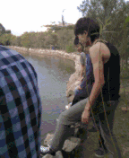

Climate Change: Day 1
=====================
date: August 26, 2014

GEO 4930-06 Special Topics in Geography: Climate Change

Tuesdays and Thursdays: 11 a.m.-12:15 p.m.

Bellamy Room 114

Will global warming create more violent storms?

Compelling Evidence of Climate Change
=====================================

* Seas are rising and becoming more acidic

* Temperatures are increasing and glaciers are melting

* Weather events are becoming more extreme (heat waves, hurricanes?, tornadoes?)

* How do we know this?

Chasing Storms
==============

* Storms are my passion. If it spins, it wins. Frisbee. 

* Hurricanes and tornadoes: Are they becoming more severe as the climate warms. How do we know?

* How can we know about tomorrow? Decision making under uncertainty. 

* The beauty of it all. [Adrift (4.5 min)](http://vimeo.com/simonchristen/)

Contact Information
===================
Professor James B. Elsner, Bellamy Room 310

Office Hours: TR 9-11 a.m., 2-3 p.m. (& by appointment)

Email: jelsner@fsu.edu

Twitter: [@hurricanejim](http://twitter.com), [@FSU_Geography](http://twitter.com)

Goal
====
My goal is to help you understand the science behind global warming as it relates to storminess.

I will focus on severe weather: in particular hurricanes and tornadoes. How are they changing? Changes in extreme weather and climate events, such as heat waves and droughts, are the primary way that most people experience climate change. 

I will teach you the basics of weather and climate and I will challenge you to think critically about how and why tornadoes and hurricanes are changing as the climate warms.

Objectives
==========
I want you to understand how scientists come to know that climate is changing. I want you to know how to draw and interpret a trend line. We call this *Scholarship in practice*.

I want you to know what evidence exists that the earth's climate is changing. I want you to know how to explain why these changes are linked to human factors.

I want you to be able to list and explain the ingredients for tornadoes & hurricanes. I want you to explain if and why hurricanes/tornadoes might be more numerous and stronger as the globe continues to warm.

Grades
======
Readings and class participation: 20%

Term project: 20%: plot a climate trend line and estimate its slope.

Exams (Three + An **Optional** Final): 60%: multiple choice, TRUE/FALSE

Required Reading
================

[National Climate Assessment](http://nca2014.globalchange.gov/)

My Passions
===========
My passion for storms began as a kid growing up in the city of Milwaukee wishing for a "snow day."  

Freedom from school. Pushing cars for cash. Interested in the nightly weather broadcast.

Forecasting is hard and humbling (sometimes humiliating): the bus would not make it to school.

Every spring I get the itch to chase tornadoes across the Great Plains.

My Passions
===========
Doing science. Teaching students how to become scientists. Teaching students how to think, write, and code.

[Is coding the new literacy?](http://www.motherjones.com/media/2014/06/computer-science-programming-code-diversity-sexism-education)

Exam Schedule
=============
**Thursday September 18th**

**Thursday October 16th**

**Thursday November 20th**

No Makeup Exams. Stop by my office (**Bellamy 310**) if you are unavailable for these dates.

[Calendar ](https://www.google.com/calendar/render?tab=mc)

Broad Ideas
===========
Meteorology vs geography: Expecting a meteorologist to be good at analyzing climate data is like expecting a set theorist to be good at deriving the QG omega equation. 

A challenge in teaching students about climate is to get them over the elitism of the calculus.  Statistics is as important, even more so.

Did global warming cause that terrible tornado? Did it make it more likely? Did global warming make this hurricane season more active?

There is a systematic increase in tornado width and length during the past 20 years. Tornado size is correlated with intensity.

Feedback
========
[Poll Everywhere](http://www.polleverywhere.com/)

Important Dates
===============
* Tuesday, September 16 Review for Exam 1
* Thursday, September 18 Exam 1
* Tuesday, October 14 Review for Exam 2
* Thursday, October 16 Exam 2
* Tuesday, November 4 No Class (travel)
* Thursday, November 6 No Class (travel)
* Tuesday, November 18 Review for Exam 3
* Thursday, November 20 Exam 3

Topics
======
* Temperature Trends (3 weeks)
* Precipitation Changes (2 weeks)
* Changes in Hurricane Activity (4 weeks)
* Changes in Tornado Activity (4 weeks)
* Changes in Other Extreme Weather (2 weeks)

Academic Honor System
=====================
Students are expected to uphold the [Academic Honor Code](http://www.eng.fsu.edu/~peterson/fsuhc.html) published in The Florida State University Bulletin and the Student Handbook. 

The Academic Honor System of The Florida State University is based on the premise that each student has the responsibility (1) to uphold the highest standards of academic integrity in the student's own work, (2) to refuse to tolerate violations of academic integrity in the university community, and (3) to foster a high sense of integrity and social responsibility on the part of the university community.

Americans With Disabilities Act
===============================
Students with disabilities needing academic accommodation should: (1) register with and provide documentation to the Student Disability Resource Center; (2) bring a letter indicating the need for accommodation and what type.  This should be done during the first week of classes.

Grading Standards
=================
Grade | Score | Standard
------|-------|---------
A     | 93-100| Outstanding: Few if any errors/omissions
B     | 85-93 | Good: Only minor errors/omissions
C     | 75-85 | Satisfactory: Minor omissions, a few major
D     | 65-75 | Poor: Several major errors/omissions
F     | < 65  | Fail: Many major errors/omissions

I will use pluses and minuses on the grades so for example a 93 could be an A- or a B+, etc.

